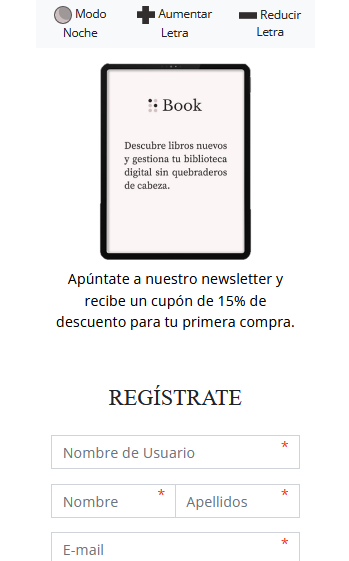
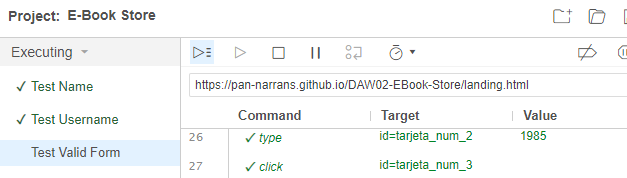

# Landing Page

* * *

- [Landing Page](#landing-page)
  - [HTML](#html)
  - [JavaScript](#javascript)
  - [Responsive](#responsive)
  - [Tests](#tests)

[La landing page se puede visualizar aquí.](https://www.google.com/url?q=https://pan-narrans.github.io/DAW02-EBook-Store/landing.html&sa=D&source=editors&ust=1668166260926382&usg=AOvVaw1shMsEyAISRoTOLfn_J5gE)

El formulario propuesto en el apartado anterior ha sido modificado a petición del cliente, por lo que el prototipo y el producto final tienen diferencias.

## HTML

Los formularios creados con HTML5 permiten saber de forma rápida dónde se encuentra el cursor, ya que éste parpadea en la pantalla. Esto ayuda a personas con visibilidad reducida y ciegas que usen línea braille para rellenar el formulario. Asimismo, el formulario permite desplazarse sin necesidad de usar el ratón, bien a través del tabulador o de la tecla enter.

Aparte, es importante usar de forma correcta los elementos semánticos que ofrece HTML5 ya que facilitan la comprensión de la página a aquellos usuarios que accedan a ella a través de un lector de pantalla.

Ejemplos de HTML semántico

Aquí se puede ver cómo hemos hecho uso de las etiquetas ‘main’ y ‘article’. La etiqueta ‘main’ permite  marcar que lo que hay dentro es el contenido principal de la página y la etiqueta ‘article’ denota que aquello que contiene es una unidad lógica independiente.

La etiqueta ‘div’ no tiene sentido semántico alguno, en este caso necesitábamos un elemento neutro para afectar el estilo visual de la página y cualquier otra etiqueta podría sería interpretada por los lectores de pantalla.

Es igualmente importante añadir atributos de ‘aria-label’ a aquellos elementos que sean interactivos para que su función quede clara e inequívoca a los usuarios que accedan desde lectores de pantalla.

Ejemplo de uso de aria-label

Asimismo, también usamos la etiqueta ‘label’ para incluir los nombres de los campos del formulario, lo que ayuda a acceder a ellos con la línea braille y lector de pantalla. Además, estos campos han sido ocultados visualmente para evitar repetir contenido, pero siguen siendo leídos por estos otros mecanismos.

Por otro lado, favoreciendo también la accesibilidad, estas etiquetas llevan el texto ‘(Obligatorio)’ incluido en el label de los campos obligatorios para clarificar que el campo es requerido.

Ejemplo de uso de label

Hacemos uso igualmente del atributo de texto alternativo para aquellas imágenes que no son únicamente decorativas si no que también acarrean significado aparte.

Ejemplo de uso de texto alternativo

Una funcionalidad de formularios HTML que muchas veces se pasa por alto es la posibilidad de incluir un botón de ‘reset’ que quite todos los valores introducidos hasta ahora en los campos del formulario.

La inclusión de este pequeño botón le es de gran ayuda a las personas de movilidad reducida en caso de cometer errores a la hora de rellenar el formulario, ya que de un solo click pueden volver a empezar de cero.

Botón de reset

Aparte de estas etiquetas, al estar desarrollando un formulario hemos hecho también uso de ‘fieldset’ y ‘legend’ para agrupar de forma lógica los distintos campos del formulario y facilitar la comprensión por línea braille.

## JavaScript

Para una mejor experiencia de usuario y permitir que el formulario sea más interactivo hemos decidido incrementar la funcionalidad que nos otorga HTML con Javascript.

En tiempo real, mientras el usuario rellena los campos del formulario vamos realizando una validación de la información introducida y le avisamos de los posibles errores que haya podido cometer. Pudiendo así el usuario corregir los datos introducidos antes incluso de darle al botón de envíar.

Ejemplo de validación en tiempo real

Otra característica importante en el formulario es, una vez enviado el mismo, mostrar un mensaje de verificación para que el usuario sepa que sus datos han sido recibidos correctamente. Esto se complementa con el evitar que el formulario se borre tras el envío para permitir al usuario revisar sus datos si lo desea.

Mensaje de éxito al envíar el formulario.

Por otra parte, haciendo uso de la función ‘focus()’ de Javascript, cuando el usuario le da a envíar formulario, en caso de haber algún campo incorrecto, la página web le redirige automáticamente al campo en cuestión para que lo pueda corregir.

Esto es especialmente útil en casos de personas con movilidad reducida o usuarios de línea braille, ahorrándoles el tener que desplazarse al campo del formulario que ha producido el error, que junto con el texto de error en la propia pantalla mejora su posibilidad de comprender la situación.

## Responsive

A día de hoy el tráfico web se realiza en gran medida desde dispositivos móviles. Es más importante que nunca que la web se vea correctamente y sea cómoda de usar desde un smartphone.

Hemos adaptado el formulario de escritorio y re-colocado los elementos en la pantalla para facilitar su lectura.

Vista de la landing desde un dispositivo móvil

## Tests

Con el objetivo de agilizar la comprobación de errores en la validación del formulario hemos implementado una serie de tests ayudándonos de la extensión Selenium IDE de Google Chrome.

Pantalla de tests de Selenium IDE

Al tener una batería de tests preparada podemos de forma automática comprobar que cualquier cambio que realicemos en el formulario cumple con los requisitos estipulados sin necesidad de probar a mano cada caso.

Para comprobar la validez de las buenas prácticas de accesibilidad a la hora de redactar el HTML hemos sometido nuestra página a los tests de Wave como podemos ver en la imágen aquí abajo.

Test de accesibilidad con Wave

En un primer lugar teníamos unos cuantos errores que gracias a las indicaciones de la página pudimos corregir.
